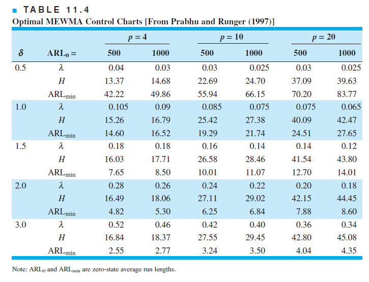
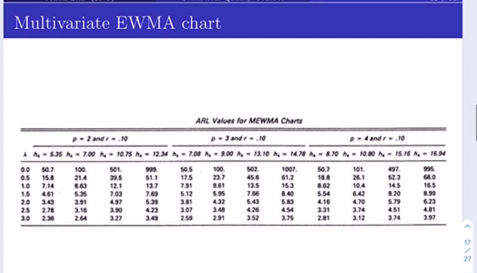

```{r setup, include=FALSE}
knitr::opts_chunk$set(echo = TRUE)
```

```{r include=FALSE}
library(ggplot2)
library(devtools)
setwd("C:/Users/DaeHyun/Desktop/Study/●Quality Control/HW/HW5_Multivariate Atrribute Control Chart")
```

#### Ex 11.8


```{r}
p=4
Sig<-matrix(rep(0.9,p*p),nrow=p,ncol=p)
diag(Sig)<-c(rep(1,p))
mu0<-c(0,0,0,0)
mu1<-c(1,1,1,1)
ARL0<-500 #desired ARL0
d<-sqrt(t(mu1-mu0)%*%solve(Sig)%*%(mu1-mu0)) #d=1.04
```



 mean shift (0,0,0,0)에서 (1,1,1,1)로 이동을 detect하는 optimal한 control chart를 구하는 문제이다. 두 평균 벡터의 통계적 거리는 약 1.04이므로 이를 1로 근사하고 위 그림으로부터 p=4, 두 평균 벡터의 통계적 거리가 1.0일 때 ARL0=500인 optimal design은 H=15.26, lambda=0.105, ARL1(minimized)= 14.6이다.

#### Ex 11.9

```{r}
p=2
Sig<-matrix(rep(0.8,p*p),nrow=p,ncol=p)
diag(Sig)<-c(rep(1,p))
mu0<-c(0,0)
mu1<-c(1,1)
ARL0<-200 #desired ARL0
d<-sqrt(t(mu1-mu0)%*%solve(Sig)%*%(mu1-mu0))
d
```

.png) 

위 그림은 ARL0=200에 대한 optimal chart의 다양한 조합을 나타내는 table이다. p=2, 평균 벡터의 통계적 거리=1.0일 때 ARL0=200에 대한 optimal design은 ARL1=9.95, lambda=0.16, UCL=9.35이다.

#### Ex 11.13

```{r}
table_4e8 <- matrix(c(
  81,56,82,
  112,73,66,
  108,62,76,
  95,61,66,
  111,68,78,
  98,65,71,
  98,64,84,
  115,72,61,
  112,72,77,
  103,63,74,
  117,72,59,
  103,71,85,
  100,65,64,
  105,64,71,
  100,71,85,
  115,66,65,
  113,84,78,
  107,71,76,
  117,74,90,
  96,68,81,
  107,60,72,
  90,57,89,
  119,69,61,
  85,59,77,
  107,70,83),
  nrow=25,ncol=3,byrow="T")
colnames(table_4e8) <- c("Systolic", "Diastolic","PulseRate")
mu0_hat<-apply(table_4e8[,1:2],2,mean)
xbar<-mu0_hat
sigma0_hat<-cov(table_4e8[,1:2])
iSig0<-solve(sigma0_hat)
HT_vec<-vector("double",length=25L) 

for(i in 1:25){
  HT<-t(table_4e8[i,1:2] -xbar)%*%iSig0%*%(table_4e8[i,1:2]-xbar)
  HT_vec[i]<-HT
}

alpha<-0.01
UCL<-qchisq(1-alpha,2) #UCL = chi-square(1-alpha) dof=2 = 9.21
ggplot(data.frame(HT=HT_vec,index=1:25), aes(x=index,y=HT))+
  geom_point()+
  geom_line()+
  geom_abline(slope=0, intercept=UCL, lty="dotted")+
  ylim(0,10)+
  theme_classic()
which(HT_vec>UCL) #17th data o.c.
```

  subsamplesize=1인 Individual X를 HT 통계량을 이용해 분석하자. 여기서 모분산을 추정하기 위해 25개의 Individual X를 모두 pool하여 하나의 데이터 셋으로 고려하고 그것의 공분산행렬을 구하였고 이 추정값을 사용하여 25개의 HT 통계량을 구할 수 있다. 다음 Ex 11.16에 이어질 m-EWMA 분석과 ARL0를 100으로 맞추기 위해 alpha=0.01로 설정한다(alpha-error를 1/ARL0로 근사할 수 있음, 강의노트 D.4 m-EWMA 20p.). 따라서 이 때 UCL = 9.21이 되고 plot 결과 17번째 데이터에서 UCL보다 큰 값이 관측되었으므로 공정은 O.C 상태라고 볼 수 있다. 이에 대한 assignble cause로는 측정설비의 이상과 측정자의 미숙련 등이 있을 것이다.

#### Ex 11.15

```{r}
#mu0_hat<-apply(table_4e8[,1:2],2,mean)
#sigma0_hat<-cov(table_4e8[,1:2])
#iSig0<-solve(sigma0_hat)
r=0.1
h4=7 #r=0.1, h4=7, p=2 gives ARL0=100
Zi<-mu0_hat
T2_vec<-vector("double",length=25L) 

for(i in 1:25){
  Zi<-r*table_4e8[i,1:2]+(1-r)*Zi
  T2<-((2-r))/(r*(1-(1-r)^(2*i)))*
    t(Zi-mu0_hat)%*%iSig0%*%(Zi-mu0_hat)
  T2_vec[i]<-T2
}

ggplot(data.frame(index=1:25,EWMA=T2_vec),aes(x=index,y=EWMA))+
  geom_point()+
  geom_line()+
  geom_abline(slope=0,intercept=h4,lty="dotted")+
  coord_cartesian(ylim=c(0,8))+
  theme_classic()

```

 

 이번 문제는 15번 문제와 같은 데이터에 대해 EWMA 통계량을 이용해 control chart를 구성하라는 문제이다. r=0.1로 두고, lambda(mean shift의 statistical distance)와 h4(UCL)의 조합에 따른 ARL 값을 강의노트의 자료를 통해 알 수 있다. 15번 문제의 ARL0 값=100을 설정하기 위해서는 h4=7로 설정하면 된다.  plot 결과 모든 데이터에서 UCL보다 작은 값이 관측되었으므로 공정은 I.C 상태라고 볼 수 있다. 
 
#### Ex 11.16

```{r}
mu0_hat3<-apply(table_4e8[,1:3],2,mean)
sigma0_hat3<-cov(table_4e8[,1:3])
iSig03<-solve(sigma0_hat3)
r=0.1
h4=9 #r=0.1, h4=9, p=3 gives ARL0=100
Zi<-mu0_hat3
T2_vec<-vector("double",length=25L) 

for(i in 1:25){
  Zi<-r*table_4e8[i,1:3]+(1-r)*Zi
  T2<-((2-r))/(r*(1-(1-r)^(2*i)))*
    t(Zi-mu0_hat3)%*%iSig03%*%(Zi-mu0_hat3)
  T2_vec[i]<-T2
}

ggplot(data.frame(index=1:25,EWMA=T2_vec),aes(x=index,y=EWMA))+
  geom_point()+
  geom_line()+
  geom_abline(slope=0,intercept=h4,lty="dotted")+
  coord_cartesian(ylim=c(0,10))+
  theme_classic()
```

 

 이번 문제는 15번 문제와 같은 데이터에 대해 3번째 변수까지 고려한 p=3 m-EWMA 통계량을 이용해 control chart를 구성하라는 문제이다. r=0.1로 두고, 앞 문제와 마찬가지 자료를 이용해 ARL0=100을 주는 h4=9로 설정한다.  plot 결과 모든 데이터에서 UCL보다 작은 값이 관측되었으므로 공정은 I.C 상태라고 볼 수 있다.

#### Ex 11.20

```{r}
s<-sigma0_hat3
s.eigen <- eigen(s)

for (s in s.eigen$values) {
  print(s / sum(s.eigen$values))
} # first two principal components account for 93% of the total variance
plot(s.eigen$values, xlab = 'Number', ylab = 'Eigenvalue', main = 'Scree Plot')
lines(s.eigen$values)

PC1_vec=vector("double",25L)
PC2_vec=vector("double",25L)
for (i in 1:25){
  PC=t(s.eigen$vectors[,1:2])%*%table_4e8[i,1:3]
  PC1_vec[i]=PC[1,]
  PC2_vec[i]=PC[2,]
}

#construct 2 uncorrelated univariate control chart with 
#alpha = 0.0027(3-sigma rule)
#total alpha error = 1 - (1-alpha)^2 = 0.0054 

#1. construct MR chart for PC1, PC2
#use I-MR chart
d2_2 <- 1.128
d3_2 <- 0.853

MR1 <- abs(PC1_vec[2:25] - PC1_vec[1:24])
MR1_bar <- mean(MR1)
UCL_MR1 <- MR1_bar + 3*MR1_bar*d3_2/d2_2
CL_MR1 <- MR1_bar
LCL_MR1 <- max((MR1_bar - 3*MR1_bar*d3_2/d2_2),0)

plot(MR1, type="b", pch=20, ylab="MR1", ylim=c(-10,50), main = 'MR chart(PC1)')
abline(h=UCL_MR1,lty="dotted")
abline(h=CL_MR1,lty="dotted")
abline(h=LCL_MR1,lty="dotted") #no outliers in MR chart PC1.

MR2 <- abs(PC2_vec[2:25] - PC2_vec[1:24])
MR2_bar <- mean(MR2)
UCL_MR2 <- MR2_bar + 3*MR2_bar*d3_2/d2_2
CL_MR2 <- MR2_bar
LCL_MR2 <- max((MR2_bar - 3*MR2_bar*d3_2/d2_2),0)

plot(MR2, type="b", pch=20, ylab="MR", ylim=c(-10,50), main = 'MR chart(PC2)')
abline(h=UCL_MR2,lty="dotted")
abline(h=CL_MR2,lty="dotted")
abline(h=LCL_MR2,lty="dotted") #no outliers in MR chart PC2.

#2. construct Individual X chart for PC1, PC2
sigma1_hat <- MR1_bar/d2_2
PC1_bar <- mean(PC1_vec)

UCL_PC1_bar <- PC1_bar + 3*sigma1_hat
CL_PC1_bar <- PC1_bar
LCL_PC1_bar <- PC1_bar - 3*sigma1_hat

plot(PC1_vec, type="b", pch=20, ylab="PC1", ylim=c(25,120), main = 'Individual X chart(PC1)')
abline(h=UCL_PC1_bar,lty="dotted")
abline(h=CL_PC1_bar,lty="dotted")
abline(h=LCL_PC1_bar,lty="dotted") #no outliers in Individual X chart PC1.

sigma2_hat <- MR2_bar/d2_2
PC2_bar <- mean(PC2_vec)

UCL_PC2_bar <- PC2_bar + 3*sigma2_hat
CL_PC2_bar <- PC2_bar
LCL_PC2_bar <- PC2_bar - 3*sigma2_hat

plot(PC2_vec, type="b", pch=20, ylab="PC2", ylim=c(80,160), main = 'Individual X chart(PC2)')
abline(h=UCL_PC2_bar,lty="dotted")
abline(h=CL_PC2_bar,lty="dotted")
abline(h=LCL_PC2_bar,lty="dotted") #no outliers in Individual X chart PC2.

```

 공분산행렬을 eigenvalue decomposition한 뒤 2번째 성분까지의 합을 구하면 0.94이므로 PC1과 PC2까지만 사용했을 때 설명할 수 있는 변동은 전체의 약 94%이다. 
 E=(e1 e2 e3)에서 e1과 e2만 사용할 때 얻어지는 PC1과 PC2 값을 모든 25개의 blood pressure 데이터에 적용한다. 그리고 PC1과 PC2 값이 uncorrelated 되어있다는 것을 고려하여, 각각 따로 univariate control chart를 구성한다. 이 때 전체 alpha-error는 각 control chart에 3-sigma rule에 따라 alpha=0.0027을 적용하면 1 - (1-0.0027)^2 = 0.0054로 2배로 높아지게 된다. subsample size=1이므로 I-MR chart 분석을 수행하면 우선 PC1과 PC2에 대한 MR chart에서 두 경우 모두 outlier가 없으므로 MR을 이용해 분산을 추정한 것이 안정적이라고 볼 수 있고, 분산 추정량을 이용해 Individual X chart에서의 UCL, LCL을 계산하고 plotting해보면 PC1과 PC2의 경우 모두 outlier가 관측되지 않았다. 따라서 I-MR chart 분석에 의해 PC1과 PC2는 모두 I.C. 상태이며 결론적으로 blood pressure 데이터를 PC analysis한 결과 I.C. 상태라고 볼 수 있다.